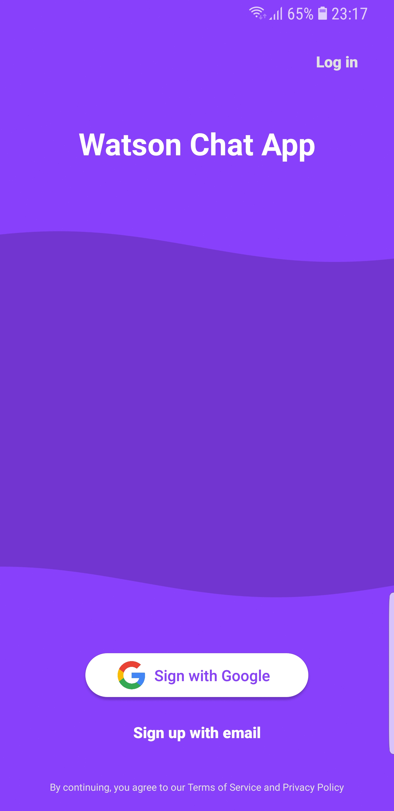
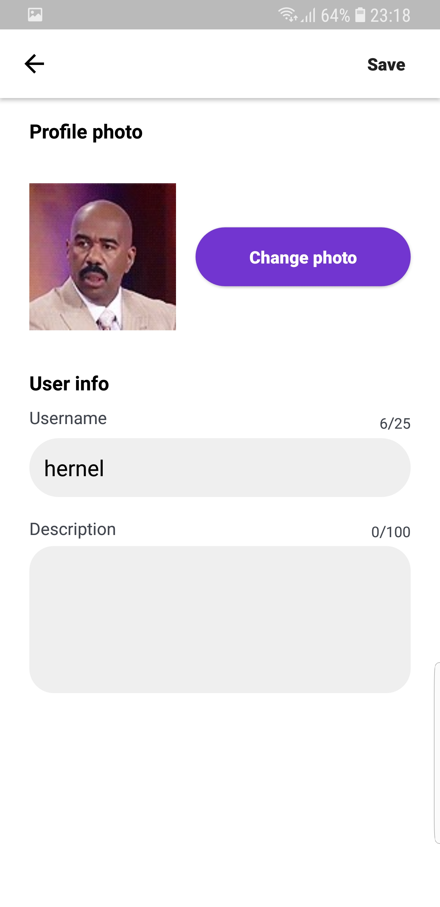
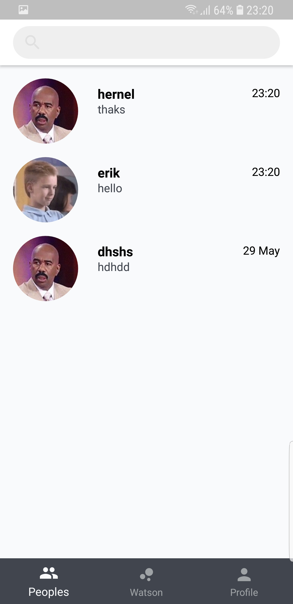
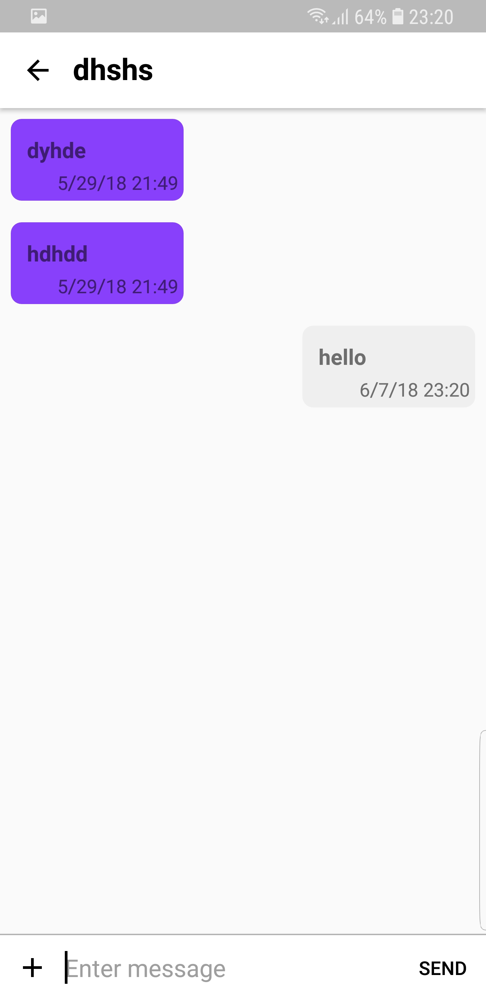

# WatsonChatBot

Android chat app build with KOTLIN.
Using firebase for login and user data. This app is still under construction.
Planned comeback is in september 2018.

## Screenshots

  
 

## Using

* [Firebase](https://tympanus.net/codrops/) - Firebase login
* [IBM Coud](https://www.ibm.com/cloud/) - IBM Cloud Watson service

## License

This project is licensed under the MIT License - see the [LICENSE](https://github.com/kubekbreha/WatsonChatBot/blob/master/LICENCE) file for details
